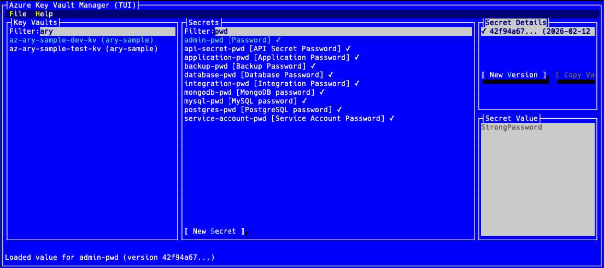

# Azure Key Vault Manager - Terminal UI

[](https://github.com/musukvl/azkv/releases)
[](LICENSE)

A terminal-based user interface application for managing Azure Key Vaults, built with [Terminal.Gui](https://github.com/gui-cs/Terminal.Gui).

## Overview

This application provides a cross-platform terminal UI for comprehensive Azure Key Vault secret management, offering better search and filter capabilities than the standard Azure Portal.



## Features

- 📋 List all Azure Key Vaults in your subscription
- 🔐 Browse secrets within each Key Vault
- 📜 View secret versions with metadata
- 👁️ Display secret values
- 📋 Copy secret values to clipboard
- 🔍 Filter Key Vaults and Secrets by name
- ➕ Create new secrets with descriptions
- ➕ Create new secret versions
- ⌨️ Full keyboard navigation
- 🖥️ Cross-platform support (Windows, macOS, Linux)

## Prerequisites

- Azure CLI (`az`) installed and configured
- Active Azure subscription with Key Vaults
- Run `az login` before using the application

## Installation

### macOS (Homebrew) - Recommended

```bash
# Add the tap
brew tap musukvl/azkv

# Install the application
brew install azkv

# Run the application
azkv --help
```

Or install in one command:
```bash
brew install musukvl/azkv/azkv
```

### Pre-built Binaries

Download the latest release for your platform from the [releases page](https://github.com/musukvl/azkv/releases):

- **macOS Apple Silicon**: `azkv-*-osx-arm64.tar.gz`
- **macOS Intel**: `azkv-*-osx-x64.tar.gz`
- **Linux x64**: `azkv-*-linux-x64.tar.gz`
- **Linux ARM64**: `azkv-*-linux-arm64.tar.gz`
- **Windows x64**: `azkv-*-win-x64.zip`
- **Windows ARM64**: `azkv-*-win-arm64.zip`

#### macOS/Linux Installation

```bash
# Extract the archive
tar -xzf azkv-*-osx-arm64.tar.gz

# Make executable
chmod +x azkv

# Move to PATH (optional)
sudo mv azkv /usr/local/bin/

# Run
azkv --help
```

#### Windows Installation

```powershell
# Extract the zip file
Expand-Archive azkv-*-win-x64.zip

# Add to PATH or run directly
.\azkv.exe --help
```

### Build from Source

Requires .NET 10.0 SDK or later.

```bash
# Clone the repository
git clone https://github.com/musukvl/azkv.git
cd azkv

# Build
dotnet build

# Run
dotnet run --project src/AzureKvManager.Tui

# Or use the build script (macOS)
./build.sh
```

## Usage

### Layout

The application is divided into four main panels:

1. **Key Vaults** (left) - Lists all available Key Vaults with filter
2. **Secrets** (center) - Shows secrets in the selected Key Vault with filter and "New Secret" button
3. **Secret Details** (top-right) - Displays versions of the selected secret with "New Version" and "Copy Value" buttons
4. **Secret Value** (bottom-right) - Shows the actual secret value

### Navigation

- **Tab** - Switch between panels
- **Arrow Keys** - Navigate through lists
- **Enter** - Select items or activate buttons
- **Alt+F** - File menu
- **Alt+H** - Help menu

### Creating Secrets

1. Select a Key Vault from the left panel
2. Click "New Secret" in the Secrets panel
3. Enter secret name, value, and optional description
4. Click "OK" to create

### Creating Secret Versions

1. Select a Key Vault and Secret
2. Click "New Version" in the Secret Details panel
3. Enter the secret value and optional description
4. Click "OK" to create

## Project Structure

```
.
├── src/
│   └── AzureKvManager.Tui/            # Terminal UI application
│       ├── Models/                    # Domain models
│       ├── Services/                  # Azure CLI integration
│       └── Views/                     # UI components
├── homebrew/                          # Homebrew formula template
├── .github/workflows/                 # GitHub Actions for releases
├── build.sh                          # Build script for local development
└── README.md
```

## Architecture

### Core Components

- **Models** - Domain models (KeyVault, Secret, SecretVersion)
- **Services** - Azure CLI service integration and business logic
- **Views** - Terminal.Gui UI components and main window

The application uses Azure CLI (`az`) under the hood for all Azure operations, ensuring consistent authentication and authorization with your existing Azure access.

## Dependencies

- **Terminal.Gui** 2.0+ - Cross-platform Terminal UI toolkit
- **Spectre.Console** 0.54+ - Console output formatting
- **.NET 10.0** - Runtime and SDK
- **Azure CLI** - Required for Azure operations

## Development

The project follows .NET 10 best practices with:
- Async/await for non-blocking operations
- Proper error handling and user feedback
- Clean separation of concerns
- Terminal.Gui best practices for responsive UI

### Local Development Build

```bash
# Build the project
dotnet build

# Run directly
dotnet run --project src/AzureKvManager.Tui

# Or use the build script (macOS)
./build.sh
```

## Contributing

Contributions are welcome! Please feel free to submit issues or pull requests.

## Creating Releases

Releases are automated via GitHub Actions:

1. Update version in `src/AzureKvManager.Tui/AzureKvManager.Tui.csproj`
2. Commit and push changes
3. Create and push a git tag:
   ```bash
   git tag v1.0.0
   git push origin v1.0.0
   ```
4. GitHub Actions will automatically:
   - Build binaries for all platforms
   - Create a GitHub release
   - Upload all artifacts

See [homebrew/README.md](homebrew/README.md) for instructions on updating the Homebrew formula.

## License

See the project for licensing information.
