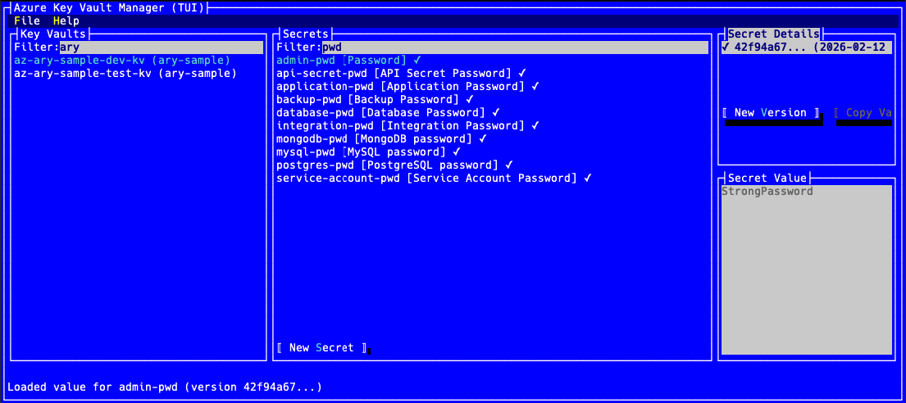

# Azure Key Vault Manager - Terminal UI

A terminal-based user interface application for managing Azure Key Vaults, built with [Terminal.Gui](https://github.com/gui-cs/Terminal.Gui).

## Overview

This application provides a cross-platform terminal UI for comprehensive Azure Key Vault secret management, offering better search and filter capabilities than the standard Azure Portal.



## Installation

### Homebrew (macOS/Linux)

```bash
brew tap musukvl/azkv
brew install azkv
```

### .Net Tool

The .net tool installation requires dotnet cli installed first [https://dotnet.microsoft.com/](https://dotnet.microsoft.com/en-us/download/dotnet/10.0).

```bash
dotnet tool install -g azkv
```

### Direct Download

You can also download the precompiled binaries directly from the [releases page](https://github.com/musukvl/azkv/releases).